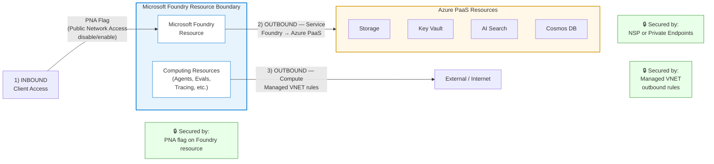
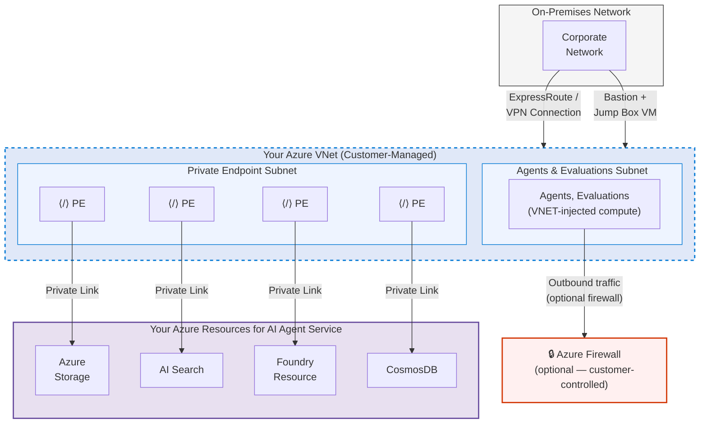
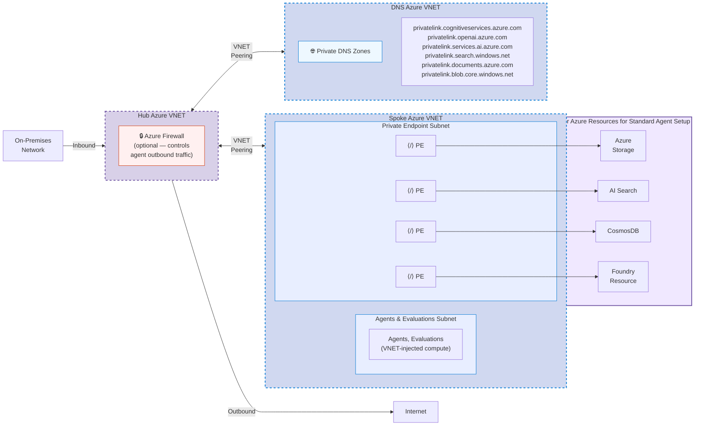
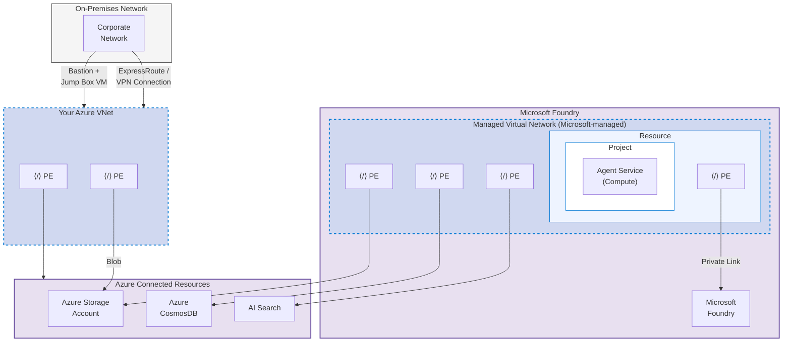
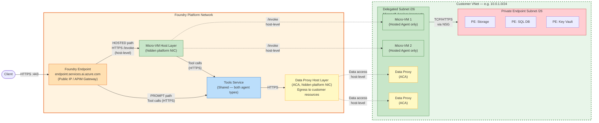

# Network Isolation — Architecture Diagrams

> Visual reference for Microsoft Foundry network isolation patterns. These diagrams complement the domain knowledge in `SKILL.md`. Render with any Mermaid-compatible viewer.

---

## Architecture Overview — Three Traffic Paths

---

## Pattern 1: Custom (BYO) VNET Setup

---

## Pattern 2: Hub-and-Spoke BYO VNET Architecture

---

## Pattern 3: Managed VNET Setup

---

## Platform-to-Customer VNet Architecture (BYO VNET Deep Dive)

